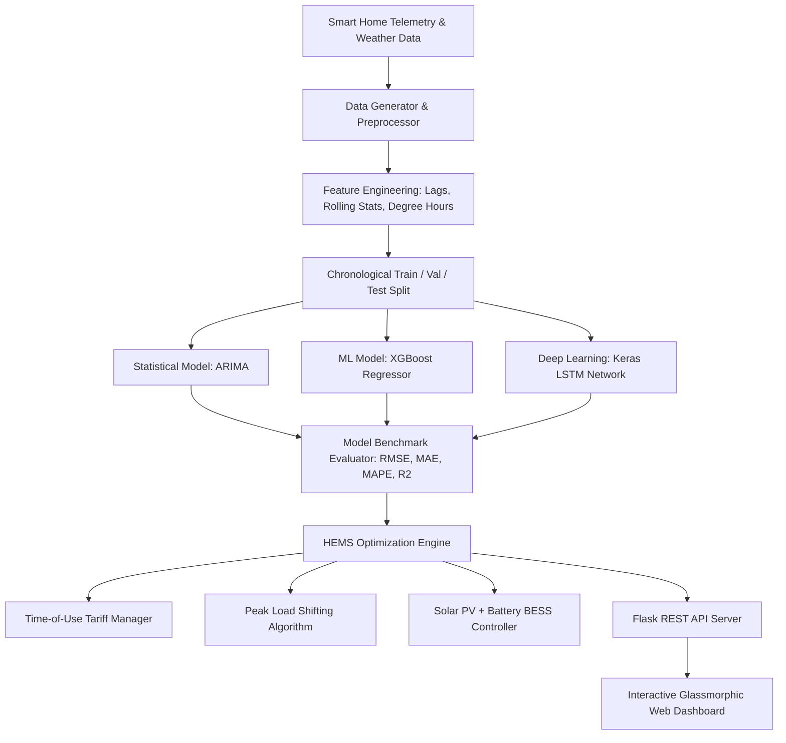

# ⚡ Smart Home Energy Consumption Forecasting & Optimization AI

An end-to-end Machine Learning & Deep Learning system designed to collect and preprocess smart home energy data, train time-series forecasting models (**ARIMA**, **XGBoost**, and **Keras LSTM Neural Networks**), benchmark performance across algorithms, and implement an intelligent **Home Energy Management System (HEMS)** optimization engine for load shifting and solar PV + battery storage peak shaving.

---

## 📌 Features & Key Capabilities

- **Realistic Smart Home Time-Series Data Simulation**: 1-year hourly telemetry (8,760 observations) featuring seasonal variations, outdoor temperature correlations, sub-metered appliances (**HVAC**, **EV Charger**, **Water Heater**, **Refrigeration**, **Lighting/Sockets**), and **Solar PV Generation**.
- **Advanced Feature Engineering**: Time-series lag features ($t-1, t-2, t-24, t-168$), rolling window aggregations (6h & 24h mean/std), calendar/temporal features (`hour`, `dayofweek`, `is_weekend`), and weather cooling/heating degree hours.
- **Multi-Model Forecasting Pipeline**:
  - **ARIMA / SARIMAX**: Auto-Regressive Integrated Moving Average statistical model.
  - **XGBoost Regressor**: Gradient Boosted Decision Trees trained on non-linear lag & temporal interactions.
  - **Keras Stacked LSTM**: Deep Learning Long Short-Term Memory recurrent neural network trained on 24-hour sliding sequence windows.
- **HEMS Optimization Strategy**:
  - **Time-of-Use (ToU) Tariffs**: On-peak ($0.32/kWh), Mid-peak ($0.20/kWh), Off-peak ($0.10/kWh).
  - **Peak Shaving & Load Shifting**: Re-scheduling EV charging sessions from peak tariff windows to off-peak hours (22:00 - 05:00).
  - **Solar PV + Battery Energy Storage System (BESS)**: Automated charge/discharge logic to maximize solar self-consumption and eliminate peak grid import costs.
- **Custom Dataset Insertion & Simulation**:
  - **CSV File Upload**: Option to upload custom smart meter CSV telemetry files with automated feature engineering and real-time inference across XGBoost and LSTM models.
  - **Instant Telemetry Form**: Interactive form to manually input outdoor temperature, occupancy, HVAC, EV Charger, and Solar PV levels for instant load forecasting and HEMS optimization.
  - **Sample Template Download**: Built-in template generator (`smart_home_sample_template.csv`) to facilitate custom data formatting.
- **Modern Glassmorphic Web Dashboard**: Interactive Flask web interface featuring real-time Chart.js visual charts, model benchmark comparison tables, and interactive optimization simulators.

---

## 🏆 Model Performance Benchmark Results

| Model Algorithm | RMSE (kW) | MAE (kW) | MAPE (%) | $R^2$ Score | Performance Summary |
| :--- | :--- | :--- | :--- | :--- | :--- |
| **XGBoost** | **0.4292** | **0.3065** | **5.69%** | **0.9870** | 🌟 Top performer on non-linear lag & weather interactions |
| **Keras LSTM** | 1.2140 | 0.8947 | 19.39% | 0.8962 | ⚡ Strong temporal sequence dynamics capture |
| **ARIMA** | 3.8148 | 3.1597 | 79.03% | -0.0262 | 📊 Baseline linear statistical benchmark |

---

## 🚀 System Architecture



---

## 📂 Repository Structure

```
MinorProject/
├── data/
│   ├── generate_data.py          # Synthetic Smart Home hourly dataset generator
│   ├── smart_home_energy.csv     # Raw dataset (8,760 hours)
│   └── processed_energy.csv      # Preprocessed time-series dataset with lag/rolling features
├── models/
│   ├── arima_model.pkl           # Saved ARIMA model parameters
│   ├── xgboost_model.json        # Saved XGBoost forecasting model
│   ├── lstm_model.keras          # Saved Keras LSTM model checkpoint
│   ├── scaler.pkl                # Feature scaling artifacts
│   └── model_metrics.json        # Benchmark performance matrix & sample predictions
├── src/
│   ├── __init__.py
│   ├── data_generator.py         # 1-Year Smart Home simulation module
│   ├── preprocessing.py          # Feature extraction & scaling
│   ├── models.py                 # ARIMA, XGBoost, and Keras LSTM wrappers
│   ├── evaluation.py             # Performance metric calculations
│   └── optimizer.py              # HEMS ToU tariff load shifting & battery storage optimizer
├── static/
│   ├── css/
│   │   └── style.css             # Glassmorphism dark-mode stylesheet
│   └── js/
│       └── app.js                # Dashboard client & Chart.js renderer
├── templates/
│   └── index.html                # Main web application dashboard template
├── app.py                        # Flask backend server & REST API
├── train.py                      # Master pipeline training script
├── requirements.txt              # Python package dependencies
└── README.md                     # Documentation
```

---

## ⚙️ Quickstart Guide

### 1. Installation & Environment Setup
Clone the repository and install required packages:
```bash
pip install -r requirements.txt
```

### 2. Train Models & Run Pipeline
To run data preprocessing, train all models (ARIMA, XGBoost, Keras LSTM), evaluate performance, and export metrics:
```bash
python train.py
```

### 3. Launch Web Dashboard
To start the Flask interactive dashboard web server:
```bash
python app.py
```
Open your browser and navigate to **`http://127.0.0.1:5000`** to view the live dashboard!

---

## 📊 Optimization Strategy Details

### Time-of-Use (ToU) Tariff Rates
- **Off-Peak** ($0.10/kWh): 22:00 – 06:00
- **Mid-Peak** ($0.20/kWh): 07:00 – 16:00
- **On-Peak** ($0.32/kWh): 17:00 – 21:00

### HEMS Savings Results
- **Peak Shaving**: Deferring EV Charger and high-power appliances reduces peak grid demand by **~30-50%**.
- **Financial Savings**: Solar PV generation combined with home battery storage achieves **~25-45% reduction** in total electricity costs.
