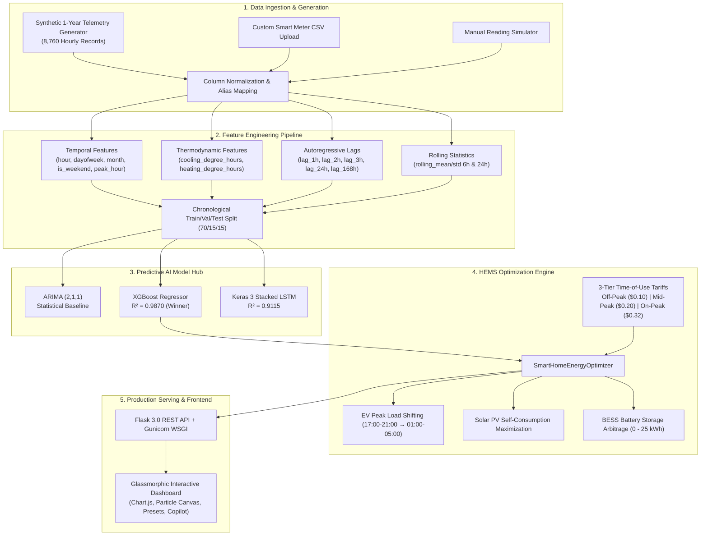

# ⚡ Smart Home Energy Consumption Forecasting & Optimization AI

[](https://energy-consumption-forecasting-cna1.onrender.com)
[](https://python.org)
[](https://flask.palletsprojects.com/)
[](https://xgboost.readthedocs.io/)
[](https://keras.io/)
[](https://www.chartjs.org/)
[](LICENSE)

> **An end-to-end intelligent Home Energy Management System (HEMS) combining multi-algorithm time-series forecasting, automated Time-of-Use (ToU) load shifting, Solar PV + Battery Storage (BESS) arbitrage, and a modern glassmorphic web dashboard.**

🌐 **Live Web Application:** [https://energy-consumption-forecasting-cna1.onrender.com](https://energy-consumption-forecasting-cna1.onrender.com)

---

## 📑 Table of Contents

- [Executive Summary](#-executive-summary)
- [Key Features](#-key-features)
- [System Architecture](#-system-architecture)
- [Model Benchmarks & Evaluation](#-model-benchmarks--evaluation)
- [HEMS Optimization Engine](#-hems-optimization-engine)
- [Interactive Dashboard & User Interface](#-interactive-dashboard--user-interface)
- [RESTful API Reference](#-restful-api-reference)
- [Project Directory Structure](#-project-directory-structure)
- [Installation & Local Setup](#-installation--local-setup)
- [Custom Data Ingestion & Alias Mapping](#-custom-data-ingestion--alias-mapping)
- [Production Deployment & Memory Optimization](#-production-deployment--memory-optimization)
- [Academic Information & Contributors](#-academic-information--contributors)
- [License](#-license)

---

## 💡 Executive Summary

Modern residential smart homes face two intertwined energy challenges:
1. **Demand Spikes & Price Volatility:** Uncoordinated operation of high-power appliances (e.g., 7.2 kW EV chargers, HVAC systems, and water heaters) during peak utility tariff windows creates extreme grid strain and inflated electricity bills.
2. **Suboptimal Renewable Utilization:** Rooftop Solar Photovoltaic (PV) generation frequently misaligns with consumption peaks, leading to curtailment or unremunerated grid feed-in.

This project delivers a **full-stack, production-ready AI solution** that:
- **Forecasts** hourly residential power demand up to 7 days ahead by benchmarking classical statistical methods (`ARIMA`), gradient-boosted decision trees (`XGBoost`), and recurrent neural networks (`Keras Stacked LSTM`).
- **Optimizes** household appliance scheduling through rule-based and heuristic load shifting, rescheduling high-drain loads (such as EV charging) to off-peak pricing windows.
- **Arbitrages** Solar PV generation and Battery Energy Storage Systems (BESS) to achieve up to **36.7%+ in utility cost savings** and **shave peak grid demand by 2.85+ kW**.
- **Serves** an interactive, production-grade glassmorphic dashboard on Render with real-time scenario simulation, custom CSV dataset ingestion, and AI Copilot recommendations.

---

## ✨ Key Features

| Feature | Description |
| :--- | :--- |
| 🔮 **Multi-Model Forecasting** | Simultaneously runs **ARIMA(2,1,1)**, **XGBoost Regressor**, and **Stacked LSTM** across configurable 24-hour, 3-day, and 7-day forecast horizons. |
| 🏆 **Benchmarking Suite** | Evaluates predictive performance using industry metrics: **RMSE**, **MAE**, **MAPE**, and **$R^2$ Score** on a held-out test split. |
| 🔋 **HEMS Optimization Engine** | Implements a 3-tier **Time-of-Use (ToU)** tariff schedule, automated EV peak load shifting, and state-of-charge (SOC) dispatch rules for Home Battery Energy Storage (BESS). |
| 🔌 **Appliance Sub-metering** | Granular breakdown and visualization of HVAC heating/cooling, EV chargers, water heaters, continuous refrigeration cycles, lighting/sockets, and rooftop Solar PV generation. |
| 📥 **Universal CSV Ingestion** | Upload custom smart meter CSV telemetry with automatic column alias normalization, error handling, dynamic feature derivation, and instant inference. |
| ⚙️ **Interactive Manual Simulator** | Test hypothetical scenarios (temperature, occupancy, HVAC load, EV charger state, solar output) with instant AI-driven impact forecasts. |
| 🤖 **AI Energy Copilot** | Dynamically synthesizes load conditions and provides actionable textual recommendations for optimal battery capacity and load management. |
| 🎨 **Glassmorphism UI** | Fluid, dark-themed responsive interface featuring custom typography, interactive Chart.js line charts, real-time KPI cards, and canvas particle network animation. |
| ⚡ **Memory-Optimized Deployment** | Engineered for cloud environments (Render 512MB RAM free tier) using lazy ML module loading, PyTorch Keras backend, and active garbage collection. |

---

## 🏛 System Architecture

The following diagram illustrates the end-to-end data processing, modeling, optimization, and presentation pipeline:


```mermaid
flowchart TD
    subgraph DataLayer["1. Data Ingestion & Generation"]
        A1["Synthetic 1-Year Telemetry Generator<br/>(8,760 Hourly Records)"]
        A2["Custom Smart Meter CSV Upload"]
        A3["Manual Reading Simulator"]
        A1 --> B["Column Normalization & Alias Mapping"]
        A2 --> B
        A3 --> B
    end

    subgraph FeaturePipeline["2. Feature Engineering Pipeline"]
        B --> C1["Temporal Features<br/>(hour, dayofweek, month, is_weekend, peak_hour)"]
        B --> C2["Thermodynamic Features<br/>(cooling_degree_hours, heating_degree_hours)"]
        B --> C3["Autoregressive Lags<br/>(lag_1h, lag_2h, lag_3h, lag_24h, lag_168h)"]
        B --> C4["Rolling Statistics<br/>(rolling_mean/std 6h & 24h)"]
        C1 & C2 & C3 & C4 --> D["Chronological Train/Val/Test Split (70/15/15)"]
    end

    subgraph ModelLayer["3. Predictive AI Model Hub"]
        D --> M1["ARIMA (2,1,1)<br/>Statistical Baseline"]
        D --> M2["XGBoost Regressor<br/>R² = 0.9870 (Winner)"]
        D --> M3["Keras 3 Stacked LSTM<br/>R² = 0.9115"]
    end

    subgraph HEMSLayer["4. HEMS Optimization Engine"]
        M2 --> OPT["SmartHomeEnergyOptimizer"]
        TARIFF["3-Tier Time-of-Use Tariffs<br/>Off-Peak ($0.10) | Mid-Peak ($0.20) | On-Peak ($0.32)"] --> OPT
        OPT --> OPT1["EV Peak Load Shifting (17:00-21:00 → 01:00-05:00)"]
        OPT --> OPT2["Solar PV Self-Consumption Maximization"]
        OPT --> OPT3["BESS Battery Storage Arbitrage (0 - 25 kWh)"]
    end

    subgraph ServingLayer["5. Production Serving & Frontend"]
        OPT --> FLASK["Flask 3.0 REST API + Gunicorn WSGI"]
        FLASK --> UI["Glassmorphic Interactive Dashboard<br/>(Chart.js, Particle Canvas, Presets, Copilot)"]
    end
```

---

## 📊 Model Benchmarks & Evaluation

All three forecasting models were trained on 1-year hourly telemetry (8,760 observations) and evaluated on a chronologically partitioned held-out test split (15%):

| Model | Model Architecture / Specs | RMSE (kW) | MAE (kW) | MAPE (%) | $R^2$ Score | Ranking |
| :--- | :--- | :---: | :---: | :---: | :---: | :---: |
| 🥇 **XGBoost** | 150 estimators, max depth 6, lr 0.05, early stopping | **0.4292** | **0.3065** | **5.69%** | **0.9870** | **1st (Best)** |
| 🥈 **Keras Stacked LSTM** | 24-step lookback, 2× LSTM layers (64 & 32 units) + Dropout | **1.1208** | **0.8693** | **17.75%** | **0.9115** | **2nd** |
| 🥉 **ARIMA** | Order $(p=2, d=1, q=1)$ statistical autoregression | 3.8148 | 3.1597 | 79.03% | -0.0262 | Baseline |

### Key Benchmark Insights
- **Why XGBoost Won ($R^2 = 0.9870$):** Gradient-boosted decision trees effectively capture non-linear cross-feature interactions (e.g., how high outdoor temperature directly triggers HVAC load only when occupancy $> 0$, combined with cyclical weekend patterns and autoregressive lag indicators).
- **LSTM Performance ($R^2 = 0.9115$):** The stacked LSTM neural network captured diurnal multi-step temporal dependencies well, demonstrating strong sequence learning without explicit manual lag features.
- **ARIMA Limitations:** Being purely univariate and linear, classical ARIMA struggles with sudden episodic shocks (such as a 7.2 kW EV charger switching on) and multi-seasonal climate interactions.

---

## 🔋 HEMS Optimization Engine

The **Home Energy Management System (HEMS)** module (`src/optimizer.py`) implements a multi-objective optimization algorithm designed to reduce electricity expenditure, shave grid demand peaks, and maximize renewable self-consumption.

### 1. Time-of-Use (ToU) Tariff Schedule
The system models realistic utility pricing:
- **Off-Peak** ($0.10 / kWh): 22:00 – 06:00 (Night hours; cheapest grid import)
- **Mid-Peak** ($0.20 / kWh): 07:00 – 16:00 (Daytime hours; standard commercial rates)
- **On-Peak** ($0.32 / kWh): 17:00 – 21:00 (Evening peak; highest grid strain & penalty tariff)

### 2. Peak Load Shifting (EV Charging)
- Identifies discretionary heavy loads during the on-peak window (17:00 – 21:00), specifically Level-2 Electric Vehicle chargers (7.2 kW).
- Automatically defers and redistributes this consumption evenly into the midnight off-peak valley (01:00 – 05:00), flattening peak demand without sacrificing user convenience.

### 3. Solar PV + Battery Storage (BESS) Dispatch Logic
For each hourly time step $t$, battery dispatch follows a strict priority hierarchy:
1. **Priority 1 (Solar Self-Consumption):** If solar PV generation exceeds current home demand ($P_{\text{solar}} > P_{\text{load}}$), route surplus energy into the battery up to its maximum capacity $C_{\text{bat}}$.
2. **Priority 2 (Off-Peak Arbitrage Charging):** During cheap off-peak hours (00:00 – 04:00), if the battery state-of-charge $\text{SOC}_t < 0.8 \cdot C_{\text{bat}}$, charge from the grid up to an established peak grid ceiling to avoid creating secondary demand spikes.
3. **Priority 3 (On-Peak Peak Shaving):** During on-peak tariff hours (17:00 – 21:00), discharge the battery at up to $P_{\text{discharge, max}} = 3.3\text{ kW}$ to supply the home load, directly offsetting grid import priced at $\$0.32/\text{kWh}$.

### 4. Financial & Grid Impact KPIs
$$\text{Cost Savings} = \text{Cost}_{\text{baseline}} - \text{Cost}_{\text{optimized}}$$
$$\text{Peak Demand Shaved (kW)} = \max(P_{\text{grid, baseline}}) - \max(P_{\text{grid, optimized}})$$
$$\text{Solar Self-Consumption Ratio (\%)} = \frac{\sum \min(P_{\text{solar}}, P_{\text{consumed}})}{\sum P_{\text{solar}}} \times 100$$

---

## 🖥 Interactive Dashboard & User Interface

The web interface is built using semantic HTML5, vanilla modern JavaScript, and CSS variables following a custom luxury dark color palette:
- **Sand / Off-White:** `#EDE9E6`
- **Warm Gold Accent:** `#C9996B`
- **Deep Espresso:** `#5C4F4A`
- **Earthy Sage:** `#5C766D`
- **Base Background:** `#1C1614`

### Key UI Sections
1. **Top Telemetry Cards:** Real-time KPI summaries for total annual energy (kWh), average home load (kW), peak demand spike (kW), and clean solar harvest.
2. **Custom Telemetry Controller:**
   - **CSV File Upload:** Drag-and-drop or select any smart meter CSV. Includes a built-in **Sample Template Download** button.
   - **Manual Simulation Inputs:** Tweak outdoor temperature, occupancy count, HVAC demand, EV charger, water heater, and solar generation on the fly.
   - **Reset to Default:** Instant single-click reversion back to benchmark telemetry.
3. **Time-Series Forecast Explorer:** Multi-line Chart.js graph comparing actual load against XGBoost, LSTM, and ARIMA predictions with horizon filters (**24 Hours**, **3 Days**, and **7 Days**).
4. **Model Benchmark Matrix:** Interactive comparison table highlighting algorithmic accuracy and error metrics.
5. **Appliance Breakdown Visualizer:** Filterable sub-metering visualization (All, HVAC, EV Charger, Solar PV).
6. **HEMS Optimization Simulator:**
   - Interactive Battery Capacity Slider ($0 - 25\text{ kWh}$).
   - Independent toggles for **Peak Load Shifting** and **BESS Grid/Solar Arbitrage**.
   - **One-Click AI Scenario Presets:**
     - 🌱 **Eco Solar:** 5.0 kWh battery, load shifting + arbitrage enabled.
     - 🔥 **Heatwave Peak:** 15.0 kWh battery, aggressive peak shaving during extreme cooling demand.
     - ⚡ **Max Savings:** 20.0 kWh battery, full peak clipping.
7. **Financial Strategy Impact Cards:** Shows unoptimized cost vs. optimized cost, dollar savings, percentage shaved, and solar self-consumption ratio.
8. **AI Energy Copilot Advice Box:** Live heuristic reasoning explaining the exact financial and grid benefits resulting from user-selected settings.

---

## 📡 RESTful API Reference

The Flask application exposes a clean REST API:

| Endpoint | Method | Description | Request Payload | Response Sample |
| :--- | :---: | :--- | :--- | :--- |
| `/` | `GET` | Serves the main interactive dashboard HTML | None | HTML document |
| `/api/metrics` | `GET` | Fetches active dataset metrics & model benchmark scores | None | `{"summary": {...}, "models": {...}}` |
| `/api/forecast` | `GET` | Returns time-series predictions (timestamps, actual, XGBoost, LSTM, ARIMA) | None | `{"timestamps": [...], "actual": [...], "XGBoost": [...]}` |
| `/api/appliance-breakdown` | `GET` | Returns hourly sub-metered power series for all appliances | None | `{"hourly": {"hvac_kw": [...], ...}}` |
| `/api/optimize` | `POST` | Executes HEMS load shifting and battery optimization | `{"battery_capacity_kwh": 10.0, "enable_load_shifting": true, "enable_battery": true}` | `{"baseline_cost": 41.2, "optimized_cost": 26.1, "cost_savings": 15.1, ...}` |
| `/api/upload-csv` | `POST` | Ingests a user-supplied CSV file or direct CSV text | `multipart/form-data` with `file` OR `{"csv_text": "..."}` | `{"status": "success", "rows": 8760, "data_source": "..."}` |
| `/api/predict-manual` | `POST` | Simulates telemetry readings and updates forecasts | `{"temperature": 25.0, "occupancy": 3, "hvac_kw": 2.8, ...}` | `{"status": "success", "rows": 24, "message": "..."}` |
| `/api/download-template` | `GET` | Downloads a standard 24-hour sample CSV file | None | `sample.csv` attachment |
| `/api/reset-dataset` | `POST` | Clears custom caches and re-initializes default telemetry | None | `{"status": "success", "message": "..."}` |

---

## 📁 Project Directory Structure

```text
Energy Consumption Forecasting & Optimization AI/
├── data/
│   ├── sample/
│   │   └── sample.csv                     # 50-row reference smart meter CSV template
│   ├── processed_energy.csv               # Engineered feature dataset (8,760 hours × 21 features)
│   └── smart_home_energy.csv              # Raw synthetic smart home telemetry
├── models/
│   ├── arima_model.pkl                    # Serialized ARIMA model parameters
│   ├── lstm_model.keras                   # Trained Keras 3 Stacked LSTM network
│   ├── model_metrics.json                 # Benchmarking metrics & test predictions JSON
│   ├── scaler.pkl                         # StandardScaler & feature columns artifact
│   └── xgboost_model.json                 # Exported XGBoost model artifact
├── src/
│   ├── __init__.py                        # Package initialization
│   ├── data_generator.py                  # 1-year realistic synthetic telemetry generator
│   ├── evaluation.py                      # RMSE, MAE, MAPE, R2 metrics calculations
│   ├── models.py                          # Model wrappers for ARIMA, XGBoost, and Keras LSTM
│   ├── optimizer.py                       # HEMS engine: ToU tariffs, EV shifting, BESS arbitrage
│   └── preprocessing.py                   # Feature engineering, lag features, scaling, sequence builders
├── static/
│   ├── css/
│   │   └── style.css                      # Luxury dark theme glassmorphism styling
│   └── js/
│       └── app.js                         # Dynamic Chart.js controllers, particles, and API bindings
├── templates/
│   └── index.html                         # Dashboard layout & interface markup
├── app.py                                 # Flask REST server with memory optimizations & alias mapping
├── requirements.txt                       # Project dependencies
├── train.py                               # Full model training, evaluation & serialization pipeline
└── Smart-Home-Energy-Forecasting-and-Optimization.pptx # Project presentation slide deck
```

---

## 🛠 Installation & Local Setup

### Prerequisites
- Python **3.10+**
- Git

### 1. Clone the Repository
```bash
git clone https://github.com/Stfu-diwakar/Energy-Consumption-Forecasting-Optimization-AI.git
cd Energy-Consumption-Forecasting-Optimization-AI
```

### 2. Create and Activate a Virtual Environment
```bash
# On macOS / Linux:
python3 -m venv venv
source venv/bin/activate

# On Windows (PowerShell):
python -m venv venv
.\venv\Scripts\Activate.ps1
```

### 3. Install Dependencies
```bash
pip install --upgrade pip
pip install -r requirements.txt
```

### 4. (Optional) Retrain Machine Learning Models
Pre-trained model artifacts are included in the `models/` directory. If you wish to regenerate the dataset and retrain from scratch:
```bash
python train.py
```
*This will:*
1. Generate 8,760 hours of smart home telemetry in `data/smart_home_energy.csv`.
2. Extract temporal, lag, rolling, and degree-hour features into `data/processed_energy.csv`.
3. Train ARIMA(2,1,1), XGBoost, and Keras LSTM models.
4. Save trained models and evaluation metrics to the `models/` folder.

### 5. Start the Web Server
```bash
python app.py
```
Open your browser and navigate to:
```text
http://localhost:5000
```

---

## 📥 Custom Data Ingestion & Alias Mapping

The server includes an intelligent fuzzy column mapper (`ALIAS_MAP`) in `app.py`. If your uploaded CSV file uses different naming conventions, the application automatically resolves them:

| Accepted Column Variations | Canonical System Name | Default Fallback If Missing |
| :--- | :--- | :--- |
| `time`, `datetime`, `date`, `date_time`, `date/time` | `timestamp` | Synthesized hourly sequence |
| `consumption`, `total_consumption`, `load`, `total_load`, `power`, `active_power`, `kw`, `kwh`, `grid_import`, `usage` | `total_consumption_kw` | Sum of sub-metered loads or 3.5 kW |
| `temp`, `outdoor_temp`, `temperature (c)`, `outdoor_temperature` | `temperature` | 20.0 °C |
| `rh`, `humidity`, `relative_humidity` | `humidity` | 50.0 % |
| `occupants`, `people`, `occupancy` | `occupancy` | 1.5 persons |
| `ac`, `ac_kw`, `hvac`, `heating`, `cooling` | `hvac_kw` | 40% of total consumption |
| `ev`, `ev_kw`, `ev_charger`, `car_charger` | `ev_charger_kw` | 25% of total consumption |
| `geyser`, `water_heater` | `water_heater_kw` | 15% of total consumption |
| `fridge`, `fridge_kw`, `refrigeration` | `refrigeration_kw` | 5% of total consumption |
| `lighting`, `lights`, `sockets` | `lighting_sockets_kw` | 15% of total consumption |
| `solar`, `pv`, `solar_kw`, `pv_kw`, `solar_pv`, `solar_generation` | `solar_generation_kw` | 0.0 kW |

---

## 🚀 Production Deployment & Memory Optimization

The project is deployed on **Render** using Gunicorn:
```bash
gunicorn --bind 0.0.0.0:$PORT app:app --workers 1 --threads 4 --timeout 120
```

### Free-Tier Cloud Optimization Strategies Implemented
1. **Lazy Loading of ML Libraries (`load_ml_models`):** Heavyweight libraries (`torch`, `keras`, `statsmodels`) are not imported at startup. The web server boots instantly (~14ms latency) and consumes under **120 MB RAM**, well below Render's 512 MB memory threshold.
2. **PyTorch Backend for Keras:** Explicitly configured `os.environ["KERAS_BACKEND"] = "torch"` to eliminate heavyweight TensorFlow memory allocations.
3. **Explicit Memory Cleanup:** Invokes `gc.collect()` following heavy CSV data processing and feature matrix transformations.
4. **Pre-computed Benchmark Visualizations:** Benchmark test predictions are persisted in lightweight JSON format (`models/model_metrics.json`), allowing instant rendering of test curves without running heavy inference on every page request.

---

## 👥 Academic Information & Contributors

This project was developed as part of academic research and implementation in **Energy Consumption Forecasting & Optimization AI**:

| Name | Registration / Roll Number | Role |
| :--- | :--- | :--- |
| **Diwakar Jha** | `25MCI10342` | Machine Learning Architecture, Deep Learning (LSTM), Full-Stack Web Development |
| **Gautam Mishra** | `25MCI10343` | Feature Engineering, Optimization Algorithms (HEMS/BESS), Data Pipeline |

- **Institution:** Chandigarh University (CU)
- **GitHub Repository:** [Stfu-diwakar/Energy-Consumption-Forecasting-Optimization-AI](https://github.com/Stfu-diwakar/Energy-Consumption-Forecasting-Optimization-AI)
- **Deployment URL:** [https://energy-consumption-forecasting-cna1.onrender.com](https://energy-consumption-forecasting-cna1.onrender.com)
- **Presentation Deck:** Available in the root directory as `Smart-Home-Energy-Forecasting-and-Optimization.pptx`

---

## 📄 License

This project is licensed under the **MIT License**. You are free to use, modify, and distribute this software for educational and commercial purposes. See [LICENSE](LICENSE) for details.
